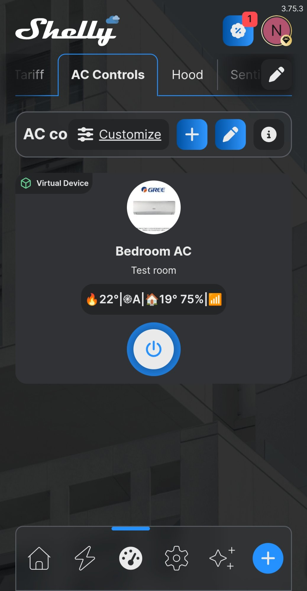
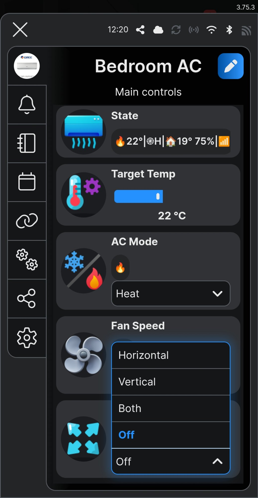
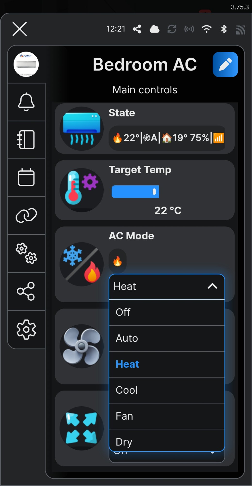
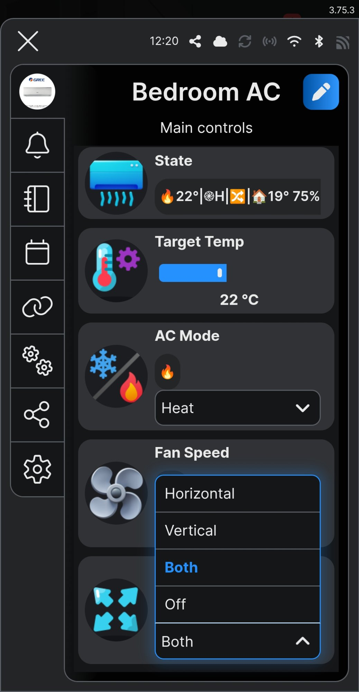

# ⚡️ SPARK_LABS: Shelly Climate Bridge v1.0
**Bring native AC control into the Shelly Smart Control app — powered by Home Assistant as an invisible local bridge.**

*Current Release: v1.0 | Target: Any Shelly Gen3 or Gen4 with virtual component support*

---

## 📸 UI Screenshots

*Climate Bridge running in the Shelly Smart Control app — Bedroom AC virtual device.*

| Device Card | Controls | AC Mode | Swing |
|:-----------:|:--------:|:-------:|:-----:|
|  |  |  |  |

---

## 🌡️ What is this?

Climate Bridge turns any compatible Shelly device into a native AC control panel inside the Shelly Smart Control app. Home Assistant acts as a silent local bridge to any HA `climate` entity — providing bidirectional sync between Shelly virtual components and your AC unit.

The Shelly app is the UI. Home Assistant is invisible infrastructure. No cloud. No proprietary AC app. No third-party dashboards.

Once installed, your AC appears in the Shelly ecosystem as a full virtual device — controllable via the Shelly app, Shelly Scenes, Schedules, and Local Automations just like any native Shelly device.

---

## 🔧 The Problem

AC units integrated into Home Assistant have no native presence in the Shelly ecosystem. Users cannot control their AC via the Shelly app, Shelly Scenes, or Shelly Schedules. From the Shelly side, the AC is completely invisible.

Climate Bridge fixes this by creating Shelly Virtual Components that represent the AC unit directly — with full bidirectional sync to HA on the local network.

---

## 🔀 How It Works

```
Shelly App (user)
      │
      ▼
Virtual Components (enum / number / boolean)
      │
      ├── User changes mode / temp / fan / swing
      │   → Brain debounces 800ms
      │   → HTTP POST to HA climate service
      │   → AC unit responds
      │
      └── HA pushes state on every climate entity change
          → Brain receives POST on /script/{id}/sync
          → Brain updates all Virtual Components
          → Sync lock (1.5s) prevents echo loop
          → Status text refreshed with health glyph
```

**Climate Bridge is 100% local.** All communication is Shelly ↔ Home Assistant over your local network — no cloud services are involved in the bridge layer. The cloudless nature of your AC unit's *underlying HA integration* (e.g. Broadlink, Daikin, Mitsubishi) depends on that integration — Climate Bridge does not change or influence it.

---

## 💻 Hardware

| Component | Role |
|-----------|------|
| Any Shelly Gen3 or Gen4 device | Hosts the scripts and virtual components. No relay, metering, or physical I/O is used or required. |
| Home Assistant instance (local) | Acts as the bridge. Must be reachable from the Shelly device over LAN. |
| Any HA `climate` entity | The AC unit already integrated into HA. Climate Bridge is integration-agnostic. |
| Shelly BLU H&T *(optional)* | Adds live room temperature and humidity to the virtual device card via BTHome. |

**Host device examples:** Shelly Gen4 Mini 1PM on a room light, Plus Plug S, Plus 1, Pro 4PM. The host device's physical function is completely independent — Climate Bridge does not interfere with it.

> ⚠️ **Important:** Home Assistant must be able to reach the Shelly device's IP address over your local network. Devices on separate VLANs or subnets require appropriate routing.

---

## ✨ Features

- **Bidirectional sync** — Changes from the Shelly app reach HA instantly. Changes in HA (schedules, scripts, voice, other automations) reflect in the Shelly app automatically.
- **Fully local** — The Climate Bridge layer communicates exclusively over your LAN. Zero cloud dependency within the bridge itself.
- **Integration-agnostic** — Works with any HA `climate` entity regardless of underlying integration or AC brand.
- **Any Shelly host** — Runs on any Gen3/Gen4 device. Shares the host cleanly without touching physical I/O.
- **Configurable capabilities** — Match your AC exactly: choose modes, fan speeds, swing options. Remove what your AC doesn't support.
- **Optional BTHome room sensor** — Pair a Shelly BLU H&T to display live room temperature and humidity on the same virtual device card.
- **Power toggle** — Optional quick-access boolean toggle for on/off. Coexists with the mode dropdown — does not replace it.
- **Compact status display** — Single-line status text with mode, fan, swing, temperature, and HA health glyph in 50 characters.
- **Passive health tracking** — Status glyph reflects HA connectivity. No active polling — zero overhead.
- **Reboot recovery** — Cached state in Script.storage restores the last known AC state after a device reboot.
- **Echo prevention** — Sync lock and last-value deduplication suppress feedback loops between Shelly and HA.
- **Preflight protection** — Installer refuses to run if SITE_CONFIG still contains placeholder values, or if components are already installed.
- **Dry-run Cleanup** — Reset a device to clean state safely with a two-pass dry-run before any deletion.

---

## 📱 Virtual Device UI

### Component Table

| # | Component | ID | Type | Direction | Condition |
|---|-----------|-----|------|-----------|-----------|
| 1 | State | `text:200` | Virtual Text | Brain writes | Always |
| 2 | Target Temp | `number:200` | Virtual Number | Shelly ↔ HA | Always |
| 3 | AC Mode | `enum:200` | Virtual Enum | Shelly ↔ HA | Always |
| 4 | Fan Speed | `enum:201` | Virtual Enum | Shelly ↔ HA | Always |
| 5 | Swing | `enum:202` | Virtual Enum | Shelly ↔ HA | `swing_modes` not empty |
| 6 | Room Temp | `bthomesensor:{id}` | BTHome | Native BTHome | `has_bthome: true` |
| 7 | Room Humidity | `bthomesensor:{id}` | BTHome | Native BTHome | `has_bthome: true` |
| 6* | Room Temp | `number:201` | Virtual Number | HA → Shelly | `has_bthome: false` |
| 7* | Room Humidity | `number:202` | Virtual Number | HA → Shelly | `has_bthome: false` |
| 8 | Power | `boolean:200` | Virtual Boolean | Shelly ↔ HA | `add_power_toggle: true` |
| — | Group | `group:200` | Virtual Group | Contains all | Always |

**AC Mode (`enum:200`)** always includes "Off" as an option — this maps directly to HA's `hvac_mode: off`. The optional Power toggle (`boolean:200`) is a supplementary quick-access control — it does not replace "Off" in the mode dropdown. Both coexist independently.

**Shelly devices support a maximum of 10 virtual components.** Climate Bridge uses between 6 and 10 slots depending on your configuration — leaving little or no room for other scripts sharing the same device. It is strongly recommended to host Climate Bridge on a **dedicated device that is not already using virtual components** — a Plus Plug S, Plus 1, or Gen4 Mini on an existing room circuit are all suitable.

If your host device already has virtual components from another script, count your available slots before running the Installer. The Installer will abort cleanly if the component limit is reached during creation.

### Status Text (`text:200`)

The status line is a compact glyph string — max 50 characters, confirmed on hardware. Raw UTF-8 characters only. It is designed to display cleanly in the small parameter slot of a Shelly dashboard card, giving a full AC state summary in a single line without truncation.

```
🔥22°|֎H|🏠19° 75%|📶       Heat, High fan, room 19°/75%, HA healthy
❄️24°|֎A|↕️|🏠21° 60%|📶    Cool, Auto fan, Swing Vertical, room data, healthy
⏸️Off|🏠20° 55%|📶           Off, room data, HA healthy
🔥22°|֎M|🏠19° 75%|⚠️        Heat, Medium fan, room data, HA warning
⏸️Off|❌                       Off, HA unreachable
```

**Mode glyphs:** ❄️ Cool · 🔥 Heat · 💨 Fan · 💧 Dry · 🔁 Auto · ⏸️ Off

**Fan glyphs:** ֎A Auto · ֎L Low · ֎M Medium · ֎H High

**Swing glyphs:** ↕️ Vertical · ↔️ Horizontal · 🔀 Both · *(omitted when Off)*

**Room data prefix:** 🏠 *(precedes room temperature and humidity when present)*

**Health glyphs:** 📶 Healthy · ⚠️ Warning (1–2 failed calls) · ❌ Down (3+ failed calls)

Health resets to 📶 automatically on any successful HA call or inbound push received.

> 📱 **Android note:** Some emoji render differently on Android compared to iOS or desktop. The glyphs are functionally identical — only the visual style varies by platform and OS version.

### Virtual Device Card Layout

Extract `group:200` as a Virtual Device *(Shelly Premium feature)* for the best card experience.

All components in the group can be added, removed, and reordered freely in the Shelly app card customisation screen. The layout below is a suggested starting point that works well for day-to-day use — it is not a requirement.

**Suggested layout:**
- **Big parameter:** Power *(boolean toggle — quick on/off)*
- **Small parameters:** State *(text:200 — full status in one line)*

The State component (`text:200`) is specifically designed to fit the small parameter slot: it shows mode, temperature, fan speed, swing, and HA health in a single compact line. Assign and order any parameters that suit your workflow.

---

## 📦 Repository Contents

### Release Scripts

| Script | Purpose | Run on boot |
|--------|---------|-------------|
| `ClimateBridge_Installer_v1.0.js` | One-time commissioning. Creates all VCs, seeds KVS, self-stops. | No — run once only |
| `ClimateBridge_Brain_v1.0.js` | Runtime engine. Bidirectional sync, status, health tracking. | Yes — always |

### Utility Scripts

| Script | Purpose | Run on boot |
|--------|---------|-------------|
| `ClimateBridge_Cleanup_v1.0.js` | Safely removes all Climate Bridge VCs and KVS keys from a device. Two-pass: dry-run first. | No — as needed |

> ⚠️ **Cleanup note:** BTHome sensor components and any scripts on the device are never touched. Only `bridge_` prefixed KVS keys and Climate Bridge virtual components are removed.

---

## 🚀 Installation

### Prerequisites

- Any Shelly Gen3 or Gen4 device with virtual component support (firmware 1.4.4 or later recommended)
- A running Home Assistant instance reachable from the Shelly device on your local network
- A `climate` entity already configured and working in Home Assistant
- A Long-Lived Access Token from your HA profile page
- *(Optional)* A paired Shelly BLU H&T sensor if you want live room temperature and humidity from a local sensor. If you do not have one, Climate Bridge can display room temperature and humidity sourced from your AC unit's HA integration instead — set `has_bthome: false` in `SITE_CONFIG`.

> ⚠️ **Reinstalling or changing configuration?** Run `ClimateBridge_Cleanup_v1.0.js` first to remove existing components and KVS keys. The Installer will abort if it detects components already installed on the device. Always dry-run Cleanup (`DO_DELETE = false`) before committing.

---

> ⚠️ **Security — HA Long-Lived Access Token:** Your HA token is stored in the Shelly device's KVS under the key `bridge_auth`. It is not transmitted externally — it is used only for local HTTP calls from the Shelly device to your HA instance. Treat it with the same care as any credential: do not paste it into shared scripts, community forum posts, or public repositories.
>
> To update a token: you can either re-run the Installer with the new token in `SITE_CONFIG`, or edit the `bridge_auth` KVS key directly in the Shelly web UI (Scripts → KVS) and restart the Brain. Editing `bridge_auth` alone is safe. **Be cautious when editing any other `bridge_` KVS keys directly** — the Brain reads its entire configuration from KVS on boot, and incorrect values can break sync silently. If in doubt, re-run the Installer from scratch using Cleanup first.

> ⚡ **Electrical safety:** Shelly devices interface with mains-powered electrical installations. If you are not qualified to work with mains wiring, engage a licensed electrician. Incorrect installation is dangerous. Climate Bridge itself runs on the host device's scripting engine and does not modify wiring — but the host device must be installed safely before any scripting work begins.

---

### Phase 1 — Home Assistant Setup

This phase prepares HA to push state to Climate Bridge on every change.

> 💡 **Tip — print_yaml:** If you set `print_yaml: true` in `SITE_CONFIG` before running the Installer, the Brain will print a HA configuration block to the Shelly console on every boot. This can help verify the correct endpoint URL is in place.
>
> **Important:** The Shelly console prepends a timestamp to every log line. The printed YAML will include these timestamps and cannot be pasted directly into HA. The recommended approach is to use the `ClimateBridge_HA_Config.yaml` file provided in the repository and fill in your `SHELLY_IP`, `SCRIPT_ID`, and `ENTITY_ID` manually.

**Step 1 — Add the rest_command**

Add the following to your `configuration.yaml`. Choose the variant that matches your setup.

**Which variant do I use?**

The difference is in room temperature and humidity — not in how the AC is controlled.

- **Variant A (`has_bthome: true`)** — You have a paired **Shelly BLU H&T** sensor on the same device. Room temperature and humidity are displayed via native BTHome — the Brain is not involved. The HA payload only needs to carry AC state (temp setpoint, mode, fan, swing).
- **Variant B (`has_bthome: false`)** — You have no BLU H&T, or you want HA to be the source of room data. The Brain writes room temperature and humidity to virtual number components from the HA push payload. The payload must include `current_temp` and `humidity` fields.

Use the variant that matches your `has_bthome` setting in `SITE_CONFIG`.

**Variant A — With BTHome sensor (`has_bthome: true`)**
```yaml
rest_command:
  sync_climate_bridge:
    url: "http://SHELLY_IP/script/SCRIPT_ID/sync"
    method: POST
    content_type: 'application/json'
    payload: >
      {
        "temp": {{ state_attr('ENTITY_ID', 'temperature') | default(21) }},
        "hvac": "{{ states('ENTITY_ID') | default('off') }}",
        "fan": "{{ state_attr('ENTITY_ID', 'fan_mode') | default('auto') }}",
        "swing": "{{ state_attr('ENTITY_ID', 'swing_mode') | default('off') }}"
      }
```

**Variant B — Without BTHome sensor (`has_bthome: false`)**
```yaml
rest_command:
  sync_climate_bridge:
    url: "http://SHELLY_IP/script/SCRIPT_ID/sync"
    method: POST
    content_type: 'application/json'
    payload: >
      {
        "temp": {{ state_attr('ENTITY_ID', 'temperature') | default(21) }},
        "hvac": "{{ states('ENTITY_ID') | default('off') }}",
        "fan": "{{ state_attr('ENTITY_ID', 'fan_mode') | default('auto') }}",
        "swing": "{{ state_attr('ENTITY_ID', 'swing_mode') | default('off') }},
        "current_temp": {{ state_attr('ENTITY_ID', 'current_temperature') | default(21) }},
        "humidity": {{ state_attr('ENTITY_ID', 'humidity') | default(0) }}
      }
```

> ⚠️ **Default values are required.** The `| default(N)` filters in the payload are not optional. Some AC integrations in HA do not report `current_temperature` or `humidity` at all — if those attributes are missing, HA will substitute an invalid value into the JSON payload and the push will fail silently without any error shown. The default filters prevent this. Leave them in place even if your AC does report these values.

Replace the placeholders:
- `SHELLY_IP` → your Shelly device's IP address
- `SCRIPT_ID` → the Brain script slot number (found in Shelly web UI → Scripts, or in the Brain boot log: `[CB] /script/7/sync registered`)
- `ENTITY_ID` → your HA climate entity e.g. `climate.bedroom_ac`

**Step 2 — Add the automation**

Add the following to your `automations.yaml`:

```yaml
- alias: Push AC to Climate Bridge
  description: "Push AC state to Shelly on every state or attribute change"
  triggers:
    - entity_id: ENTITY_ID
      trigger: state
  actions:
    - action: rest_command.sync_climate_bridge
  mode: queued
  max_exceeded: silent
```

`mode: queued` ensures every state change is processed in order — no changes are dropped under rapid updates. `max_exceeded: silent` suppresses the HA warning log when the queue fills during rapid changes.

**Step 3 — Restart Home Assistant**

`rest_command` is defined in `configuration.yaml` and requires a **full HA restart** — not a partial reload.

*Settings → System → Restart Home Assistant*

**Step 4 — Verify the push is working**

Before running the Installer, confirm HA can reach the Shelly device:

*Developer Tools → Actions → `rest_command.sync_climate_bridge` → Call Action*

You should see activity in the Shelly script console. If no push arrives, check:
- HA can ping the Shelly IP (cross-subnet routing if needed)
- The `SCRIPT_ID` placeholder has been replaced with the actual script number
- The automation shows a recent "Last triggered" timestamp

---

### Phase 2 — The Installer

**Step 1 — Create a new script** on your Shelly device named `ClimateBridge_Installer`.

**Step 2 — Paste** the contents of `ClimateBridge_Installer_v1.0.js`.

**Step 3 — Edit `SITE_CONFIG`** at the top of the script. This is the only section you edit. See the full [SITE_CONFIG Reference](#️-site_config-reference) below.

Key items to fill in:
- `ha_token` — your HA Long-Lived Access Token
- `ha_url` — your HA URL e.g. `http://192.168.1.X:8123`
- `entity_id` — your `climate` entity e.g. `climate.bedroom_ac`
- `device_name` — display name for the virtual device e.g. `Bedroom AC`
- `modes`, `fan_speeds`, `swing_modes` — match your AC's actual capabilities exactly

**Optional features — enable or disable to match your setup:**

| Flag | What it does | Default |
|------|-------------|---------|
| `has_bthome` | `true` — Installer adds your existing paired BLU H&T sensor components to the group. Room temp and humidity display natively, Brain is not involved. `false` — Brain writes room temp and humidity from HA push data into virtual number components instead. | `false` |
| `add_swing` | `true` — creates the Swing virtual component (`enum:202`) and enables swing sync. `false` — no swing component created, swing is ignored entirely. Set to `false` if your AC has no swing control. | `true` |
| `add_power_toggle` | `true` — creates a boolean Power toggle (`boolean:200`) for quick on/off. `false` — no toggle created. The mode dropdown always includes "Off" regardless of this setting. | `true` |

> ⚠️ **Match your HA entity exactly.** Open your climate entity in HA Developer Tools → States and check the available `hvac_modes` and `fan_modes` attributes. Only include modes your AC actually supports.

> ⚠️ **HA uses `fan_only` — Climate Bridge shows `Fan`.** HA's internal name for fan-only mode is `fan_only`. Climate Bridge maps this automatically. In `SITE_CONFIG.modes` you write `'Fan'` — the Installer generates the correct mapping.

**Step 4 — Run the Installer.** Watch the console. You will see each phase logged as it completes.

The Installer self-stops on completion. You do not need to manually stop it.

**Step 5 — Delete the Installer script.** It is no longer needed.

**Step 6 — Refresh the Shelly app.** The new virtual device components should appear.

---

### Phase 3 — The Brain

**Step 1 — Create a new script** named `ClimateBridge_Brain`.

**Step 2 — Paste** the contents of `ClimateBridge_Brain_v1.0.js`.

**Step 3 — Do not edit the Brain.** All configuration was written to KVS by the Installer. The Brain reads everything from KVS on boot — there is nothing to configure in the Brain script itself.

**Step 4 — Run the Brain.** Check the console for:
```
[CB] Brain v1.0 boot
[CB] /script/7/sync registered
[CB] Boot complete
```

Note the `/script/N/sync` line — this is the `SCRIPT_ID` you need in your HA rest_command.

**Step 5 — Enable "Run on Startup"** for the Brain script.

> ⚠️ **Always test before enabling auto-start.** Confirm the Brain is running correctly and syncing with HA before enabling Run on Startup.

---

### Phase 4 — Virtual Device Card *(Optional — Shelly Premium)*

For the cleanest UI experience, extract the Climate Bridge group as a standalone virtual device:

**Step 1 —** In the Shelly app, go to **Components** and locate the `group:200` group created by the Installer.

**Step 2 —** Tap the **Settings** (cog) icon on the group.

**Step 3 —** Select **"Extract virtual group as device".**

**Step 4 —** Open the new device card. Go to **App Settings (two cogs) → Customize device card.**

**Step 5 —** Assign your preferred parameters to the card layout slots. All components in the group can be added, removed, and reordered. A suggested starting point:
- **Big parameter:** Power *(boolean toggle — if `add_power_toggle: true`)*
- **Small parameters:** State *(text:200 — full status summary in one line)*

The State component is designed to fit the small slot cleanly. Customise the layout to suit your preferences — there is no fixed requirement.

---

## ⚙️ SITE_CONFIG Reference

| Key | Description | Default | Notes |
|-----|-------------|---------|-------|
| `ha_token` | HA Long-Lived Access Token | `'YOUR_TOKEN'` | From HA Profile → Long-Lived Access Tokens |
| `ha_url` | HA base URL including port | `'http://192.168.1.X:8123'` | No trailing slash. Must be reachable from Shelly. |
| `entity_id` | HA climate entity ID | `'climate.your_ac'` | Must match HA exactly e.g. `climate.bedroom_ac` |
| `device_name` | Virtual device display name | `'Bedroom AC'` | Appears as device name in Shelly app |
| `modes` | AC mode options | `['Off', 'Auto', 'Heat', 'Cool', 'Fan', 'Dry']` | Include only modes your AC supports. `'Off'` is required. `'Fan'` maps to HA `fan_only`. |
| `fan_speeds` | Fan speed options | `['Auto', 'Low', 'Medium', 'High']` | Match your AC's HA `fan_mode` attribute values (capitalised). |
| `swing_modes` | Swing mode options | `['Horizontal', 'Vertical', 'Both', 'Off']` | Set to `[]` to skip swing entirely. |
| `has_bthome` | Room sensor source | `false` | `true` = Installer adds your paired BLU H&T sensor components to the group. Room data is native BTHome — Brain is not involved. `false` = Brain writes room temperature and humidity to virtual number components, sourced from your AC unit's HA integration (via the `current_temperature` and `humidity` attributes on the climate entity). |
| `bthome_ids` | BTHome component IDs | `{ temp: 201, humidity: 200 }` | Component IDs of your paired BLU H&T sensor. Find in Shelly app → Components. |
| `add_swing` | Create swing component | `true` | Set `false` if `swing_modes` is empty and you want to be explicit. |
| `add_power_toggle` | Create boolean power toggle | `true` | Adds a quick on/off toggle alongside the mode dropdown. |
| `temp_min` | Temperature slider minimum | `16` | In °C |
| `temp_max` | Temperature slider maximum | `30` | In °C |
| `icons` | Virtual component icon URLs | Icons8 confirmed URLs | Pre-filled with tested Icons8 URLs. Change only if you want different icons. See [Credits](#-credits--attribution) for attribution. |
| `mode_titles` | Emoji titles for mode dropdown | Emoji map | Raw UTF-8 emoji displayed in the mode dropdown. |
| `fan_titles` | Emoji titles for fan dropdown | Emoji map | Raw UTF-8 emoji displayed in the fan dropdown. |
| `swing_titles` | Emoji titles for swing dropdown | Emoji map | Raw UTF-8 emoji displayed in the swing dropdown. |
| `debug` | Verbose console logging | `false` | Set `true` during initial setup to trace sync activity. |

---

## 🏠 Home Assistant Configuration Reference

The complete HA YAML is provided in `ClimateBridge_HA_Config.yaml` in the repository.

### Finding your SCRIPT_ID

The Brain logs its HTTP endpoint on boot. In the Shelly console, look for:
```
[CB] /script/7/sync registered
```
The number after `/script/` is your `SCRIPT_ID`. Alternatively, check Shelly web UI → Scripts and note the number next to the Brain script.

### After any configuration.yaml change

`rest_command` lives in `configuration.yaml`. Changes require a **full HA restart** — partial reloads (YAML reload) do not pick up `rest_command` changes.

### Verifying the push

*HA Developer Tools → Actions → `rest_command.sync_climate_bridge` → Call Action*

Watch the Shelly Brain console for:
```
[CB] sync [PUSH] hvac=cool fan=high t=24
```

If no log appears, verify:
1. HA can reach the Shelly IP on your local network
2. `SCRIPT_ID` in the rest_command URL is correct
3. The Brain is running (not just saved)
4. The HA automation is enabled and shows a recent "Last triggered" timestamp

---

## 🧠 Architecture

Climate Bridge uses a two-script design. All configuration lives in KVS — the Brain never contains site-specific values.

### Brain (`ClimateBridge_Brain_v1.0.js`)

The runtime engine. Runs continuously on boot. Responsibilities:
- Loads all configuration from KVS on boot
- Probes for optional virtual components (`HAS_SWING`, `HAS_POWER`, `HAS_ROOM_VC`) and sets feature flags
- Registers HTTP endpoint `/script/{id}/sync` for inbound HA pushes
- Subscribes to Virtual Component status events for outbound sync
- Debounces rapid user input (800ms) before sending to HA climate services
- Applies sync lock (1.5s) after inbound writes to suppress echo loops
- Maintains passive health tracking via `ha_fail_count`
- Caches last known state in `Script.storage` for reboot recovery
- Builds and maintains compact status text in `text:200`

Brain is fully event-driven. No polling loop — zero overhead at idle.

### Installer (`ClimateBridge_Installer_v1.0.js`)

One-time commissioning script. Responsibilities:
- Validates `SITE_CONFIG` — aborts on placeholder values or existing components
- Seeds all `bridge_` KVS keys (auth, core, VC IDs, bidirectional value maps)
- Creates and configures all virtual components conditionally based on `SITE_CONFIG`
- Assembles `group:200` in locked UI display order
- Adds BTHome sensor components to group if `has_bthome: true`
- Self-stops on completion via `Shelly.getCurrentScriptId()`

Run once. Delete after. Never edit the Brain for site configuration.

### Cleanup Utility (`ClimateBridge_Cleanup_v1.0.js`)

Safe device reset. Always run in dry-run mode first (`DO_DELETE = false`) to verify what will be removed before committing.

Does not touch: BTHome components, any scripts, or KVS keys from other projects.

---

## 🗄️ KVS Reference

All KVS keys use the `bridge_` prefix. Seeded by the Installer on first run.

| Key | Contents | Written by |
|-----|----------|------------|
| `bridge_auth` | HA Long-Lived Access Token | Installer |
| `bridge_core` | HA URL, entity ID, flags (`debug`, `print_yaml`, `has_bthome`) | Installer |
| `bridge_vc` | Virtual component ID map | Installer |
| `bridge_schema` | Spec version string | Installer |
| `bridge_map_mode_ha` | HA → Shelly mode lookup | Installer |
| `bridge_map_mode_sh` | Shelly → HA mode lookup | Installer |
| `bridge_map_fan_ha` | HA → Shelly fan lookup | Installer |
| `bridge_map_fan_sh` | Shelly → HA fan lookup | Installer |
| `bridge_map_swing_ha` | HA → Shelly swing lookup *(conditional)* | Installer |
| `bridge_map_swing_sh` | Shelly → HA swing lookup *(conditional)* | Installer |

Total: 10 keys (8 without swing). Well within the Shelly 100-key KVS limit. All values confirmed under 253 bytes.

**Script.storage** — `last_state` (1 slot): cached AC state JSON for reboot recovery. Written by Brain on every successful inbound push.

---

## 🔧 Troubleshooting

**Brain boots but status shows ❌ immediately**
HA is not sending pushes, or the first syncFromHA call failed. Verify HA can reach the Shelly IP, and that the Brain endpoint URL and SCRIPT_ID are correct in your rest_command.

**Status shows ⚠️ then recovers**
Intermittent HA connectivity — normal during HA restarts or brief network interruption. Status resets to 📶 automatically on the next successful inbound push or outbound call.

**Shelly app shows mode changes don't reach HA**
Check the Brain console for `[CB] OUT` lines. If outbound calls are firing but HA is not responding, check the HA token is valid (Long-Lived Access Tokens expire if manually revoked).

**HA push arrives but VCs don't update**
Check for `[CB] sync` lines in the Brain console. If the push is received but values look wrong, check the `bridge_map_mode_ha` KVS key matches your HA entity's `hvac_modes` values — particularly `fan_only` vs any custom fan-mode naming your integration uses.

**Installer aborts on preflight**
Either `SITE_CONFIG` still contains placeholder values (`YOUR_TOKEN`, `192.168.1.X`, `climate.your_ac`) or `text:200` already exists on the device. Run Cleanup first, then re-run the Installer.

**SCRIPT_ID is unknown**
Start the Brain script and check the console for `[CB] /script/N/sync registered`. The number N is your SCRIPT_ID. Update your HA rest_command URL and do a full HA restart.

**HA automation not triggering**
`rest_command` requires a full HA restart after adding to `configuration.yaml` — a YAML reload is not sufficient. Confirm the automation is enabled and the entity trigger is set to the correct entity ID.

---

## 🗺️ Roadmap

### v1.1 — Multi-Device Package
One Shelly hosts multiple AC entities. A device selector virtual component (`enum:204`) switches the active entity. Shared controls, per-entity state cache.

*All entities in a multi-device installation must share identical capabilities (same modes, fan speeds, swing options).*

### v1.1 — Simulator Script
Test harness for the Brain. Injects synthetic HA push events and logs sync behaviour without requiring a live HA connection.

### v2.0 — Preset Modes
Eco / Sleep / Boost presets stored in KVS. Single-tap shortcuts to common temperature + mode combinations.

### v2.0 — Power-Based Idle Detection
Optional addon using Shelly EM energy monitoring to detect AC compressor state (idle vs active) for display in status text.

### Future
- Heat/cool temperature offset overrides
- Energy tracking and cost display
- Terminal console (`text:202`) for runtime diagnostics

---

## 🤝 Credits & Attribution

**Icons**
Component icons provided by [Icons8](https://icons8.com). The default icon set in `SITE_CONFIG.icons` uses confirmed-working Icons8 URLs tested on Shelly hardware. Icons8 attribution is required under their free-use licence — please retain it if you use the default URLs or substitute your own Icons8 selections.

**Shelly Script Foundation**
Climate Bridge is built on patterns and examples from the official [Shelly Script Examples repository](https://github.com/ALLTERCO/shelly-script-examples) by Allterco Robotics. The KVS loader pattern, serial RPC queue, and virtual component creation patterns are adapted from those examples.

**Shelly Academy**
Advanced scripting knowledge, best practices, and the deep understanding of the Shelly Virtual Component API that made this project possible came directly from [Shelly Academy](https://www.shelly.com/pages/academy). Thank you to all the instructors for the exceptional course content.

**Shelly Academy — Emre**
A special thank you to **Emre** at Shelly Academy, whose example script was the direct inspiration for Climate Bridge. His example demonstrated the core pattern at the heart of this project: using a Home Assistant `rest_command` to push state into a Shelly device via HTTP RPC, and handling it on the Shelly side using a Virtual Component. That approach — HA as the push source, Shelly as the receiver — is the architectural foundation that Climate Bridge builds on and extends into a full bidirectional sync engine.

---

## 📝 Changelog

### v1.0 — March 2026
- Initial release — single-device package
- Bidirectional sync: outbound debounce (800ms), inbound sync lock (1.5s)
- Configurable capabilities: modes, fan speeds, swing modes, power toggle
- BTHome and virtual number paths for room temperature and humidity
- Passive health tracking with status glyph (📶 / ⚠️ / ❌)
- Reboot recovery via Script.storage cache
- Preflight-guarded Installer with self-stop
- Cleanup utility with dry-run mode

---

## Built on the Foundations of Shelly Academy

⚡ SPARK_LABS — Shelly Powered Automation Reliable Kontrol
Technician, installer & Shelly Academy graduate

*Turning everyday Shelly devices into truly smart virtual appliances.*

[github.com/Nc-eW22](https://github.com/Nc-eW22)
